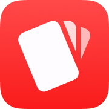
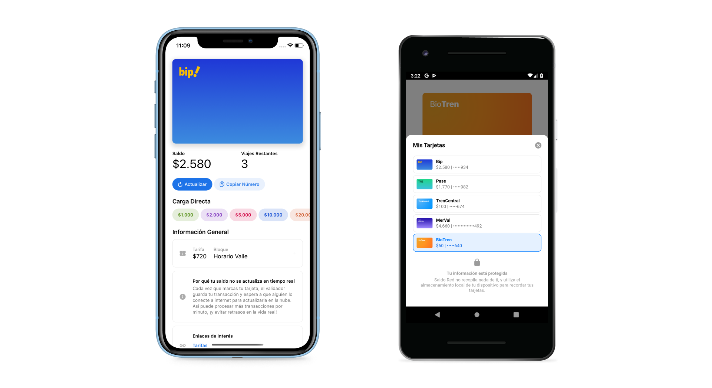

# Saldo Red

Este repositorio contiene la versión original de Saldo Red, una aplicación para administrar tarjetas de transporte público Chilenas creada el 2019 por [Laura Sandoval](https://twitter.com/laurasideral), con la gran ayuda de [Eduardo Riveros](https://github.com/eriverosr). El código es viejo, desordenado y poco legible. La mayoría de los endpoints que usa la app están deprecados (no funcionan y nadie los mantiene), y diría que el 90% del código sigue exactamente igual a como estaba a principios de 2019, cuando este proyecto era mi espacio principal de aprendizaje y exploración con el código.

## Historia y actualidad

Saldo Red partió el 2018 como una aplicación web para ver el saldo de tarjetas Bip. A principios de 2019, aún como aplicación web, agregué soporte para consultar el saldo de más tarjetas (como la tarjeta del BioTren, la de TrenCentral, la del Metro de Valparaíso, entre otras) y a mediados del mismo año envolví el código en [Apache Cordova](https://es.wikipedia.org/wiki/Apache_Cordova), un framework horriblemente malo para convertir aplicaciones web a "nativas".

Durante 2020, Saldo Red recibió pequeñas dosis de soporte para mantener el proyecto funcionando (como se puede ver en [el único commit de ese año](https://github.com/laurasandoval/SaldoRed/commit/eb26ecbd0210d6f5810133eb19415202eb33075e)), y a finales de 2021 finalmente pasó a mejor vida, siendo reemplazada por [Balance](https://balanceapp.cl), una versión moderna, más estable, y realmente nativa.

## Cómo explorar el código

La versión más actualizada de este código está en `/platforms/ios/www/index.html` (el grueso de esta app estaba contenido en un único archivo HTML que pesaba 80kb). Los estilos CSS, que ayudaban a mantener la ilusión de app nativa, están en `/platforms/ios/www/css/index.css`.  En `/platforms/ios/www/plugins` puedes encontrar los 7 plugins que usaba para acceder a algunas APIs realmente nativas.

El resto de carpetas y archivos literalmente no sé lo que tienen y nunca lo supe tampoco (y si lo supe, no me acuerdo). De nuevo, este proyecto fue un espacio de aprendizaje y exploración, así que está lleno de inconsistencias e imperfecciones.

Si te interesa, puedes encontrar una versión aún más antigua en `/www/index.html`. Creo que de ahí salía la versión de Android de Saldo Red, pero honestamente no recuerdo.

## Cómo compilar el código

Se supone que hay formas oficiales de hacerlo con la terminal pero nunca supe cómo. Yo lo hacía con Xcode y Android Studio. Con Android Studio no recuerdo cómo lo hacía, pero para iOS iba a `/platforms/ios/` y abría `SaldoRed.xcodeproj`.

Si quieres probarlo en tu computador, también puedes abrir `index.html` con Google Chrome y poner el navegador en modo inspección + responsive. Los eventos de JS estaban amarrados a `ontouch` así que un navegador de escritorio normal no los reconoce. En todo caso tampoco es muy estable probarlo así porque hay un par de cosas que dependen de los plugins que hacen puente con APIs nativas.

_**Nota**: La última versión que fue lanzada al App Store –justo antes de deprecar la app– contenía una función que revisaba si Saldo Red había sido deprecada o no y, en caso de que sí, agregaba una muralla enorme que te obligaba a descargar Balance. Antes de hacer el repositorio público modifiqué ese chequeo para que no haga nada, y así puedas jugar con la experiencia Saldo Red del 2019. Si quieres ver el resultado real del chequeo tienes que des-comentar las líneas 70-81 del archivo `/platforms/ios/www/index.html`._

## Soporte

El código se entrega tal y como viene, sin ningún tipo de promesa de soporte.

## Permisos

Decidí hacer público este repositorio con fines educacionales, o como una forma extraña de decir "tu código puede ser bastante malo e igual resultar en un producto que la gente quiera usar". **No tienes permiso de reutilizar este código en ni copiarlo en tus proyectos.** Francamente, no lo recomiendo tampoco.

Puedes compilar y utilizar la app resultante si quieres, aunque la mayoría de las APIs están dadas de baja y sin mantención, así que úsala bajo tu propio riesgo.

## Futuro

Este código nació medio malo así que no tengo ninguna intención de revivirlo. Si quieres usar una app parecida a Saldo Red puedes descargar [Balance](https://balanceapp.cl), su sucesora moderna y realmente nativa ❤️.